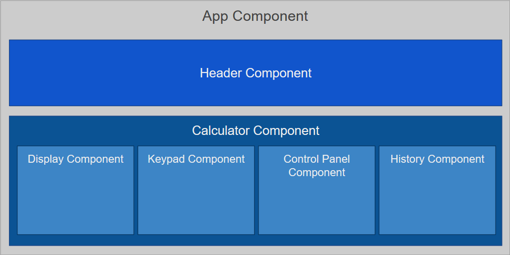
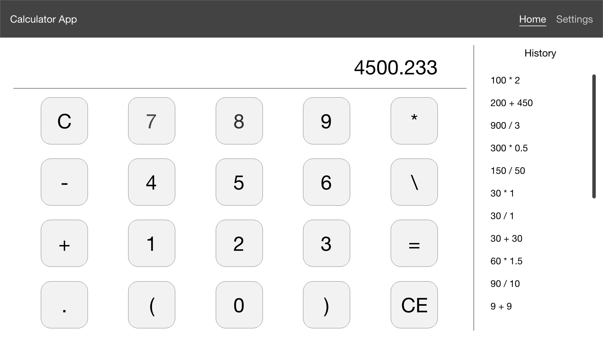
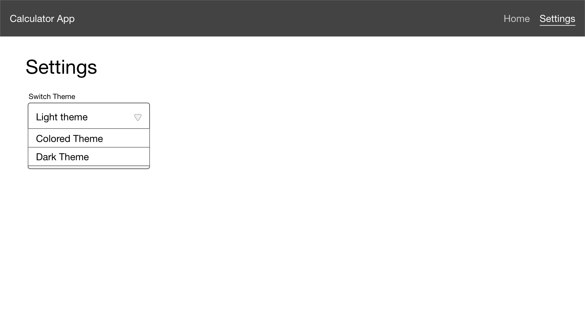

# Task #2: Calculator

## Content

- [Specification](#Specification)
- [Tech stack](#Tech-stack)
- [Testing](#Testing)

## Specification

### Components

- [x] **Header** - Application header (with a list of pages).
- [x] **Calculator** - Logic root and data manager.
- [x] **Display** - Displays current expression and calculation result.
- [x] **History** - Displays a list of the previously computed expressions.
- [ ] **ControlPanel** - Non-computational operations (e.g. show/hide history).
- [x] **Keypad** - Computational operations (operands and operators).

### Required functionality

#### Calculator
- [x] Addition
- [x] Subtraction
- [x] Multiplication
- [x] Division
- [x] Compute (equals)
- [x] Complex expressions
- [ ] Controllable precision (3 by default)
- [x] Clear
- [x] Change sign key

#### History
- [ ] Show/hide history
- [ ] See history
- [ ] Clear history

#### Additional functionality

- [x] Support for short real numbers format within the range (0; 1): e.g. `.745` instead of `0.745`
- [ ] Implement the modulus operation: `17 % 10 = 7`

### How the application should look

Design layout: [Layout XD](https://xd.adobe.com/view/3d64c8c6-a59f-4785-736f-6b50257b8e83-4b55/).

Main page: 

Settings page: 

### Miscellaneous
- [ ] Implement requests using the [Command pattern](https://refactoring.guru/ru/design-patterns/command).
- [x] Implement 2 versions: one using *functional components* and the other using *class components*.
- [ ] Error handling with *Error Boundaries*.
- [ ] Dark and light theme using *styled-components*.
- [x] Import aliases.

## Tech stack

- **nodejs** - Runtime.
- **webpack** - Bundler.
- **yarn** - Package manager.
- **react** - SPA library.
- **react-router-dom** - Router for react (DOM edition).
- **react-redux** - State management tool.
- **styled-components** - JSS tool.
- **cypress** — e2e testing framework.

## Testing

Coverage:
- [ ] Operators.
- [ ] History.
- [ ] Display.
- [ ] Keypad.
- [ ] Navigation.
- [ ] Theming.
